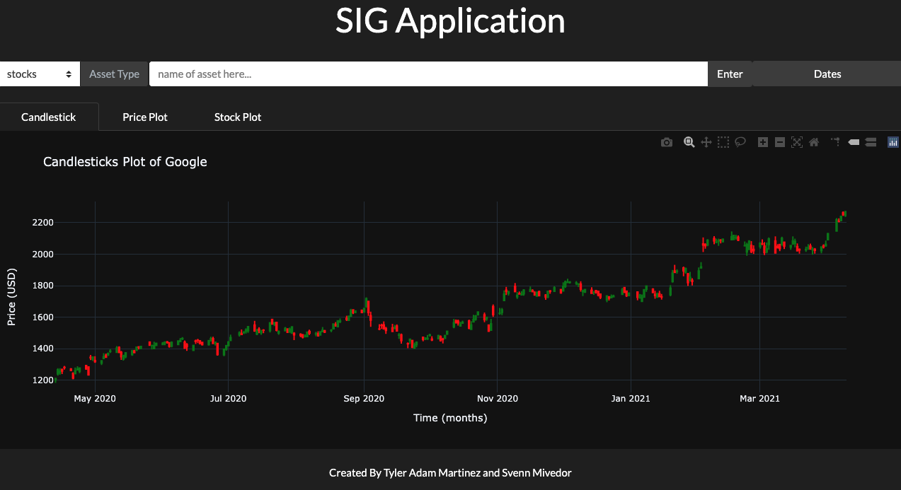

# SIG Application
This repository contains the code base for the SIG application that Logan's 2021 Team ( [Tyler Adam Martinez](https://github.com/TylerAdamMartinez "Tyler's Amazing Github profile") and [Svenn Mivedor](https://github.com/svennm "Svenn's Even better Github profile") ) created.  The program was designed for junior analysts in the SIG junior analyst program. 

### Ideal for Future Development by future SIG junior analysts

1. Clean Code 
2. Test Driven Development
3. Free Open-Source Software

#### Current Versions
* Python 3.9.1

## Required Python Libaraies

### CALCULATIONS
`pip3 install matplotlib`  
`pip3 install plotly`  
`pip3 install numpy`  
`pip3 install pandas`  

### BACKEND (APIs)
`pip3 install cryptocompare`  
`pip3 install yfinance`  

### FRONTEND
`pip3 install rich`  
`pip3 install dash`  
`pip3 install dash-bootstrap-components`  

## Graphly display data about Cryptocurrencies and Stocks
### Graphic Interfaces
* **Rich** | *Stylized Terminal* 
* **Dash** | *Web GUI*
* **Matplotlib** pyplot | *Graphs*
* **Plotly** graph_objects | *Plots*
### APIs
* **[CryptoCompare](https://min-api.cryptocompare.com/ "Crypto Currency API Documentation Page")** | *Cryptocurrenies data*
* **[yfinance](https://pypi.org/project/yfinance/ "pypi yfinance Project Page")** | *Stocks data*

## Gallery of SIG Application

### Stylized Terminal

### Front End 

##### README.md last updated April 11, 2021

